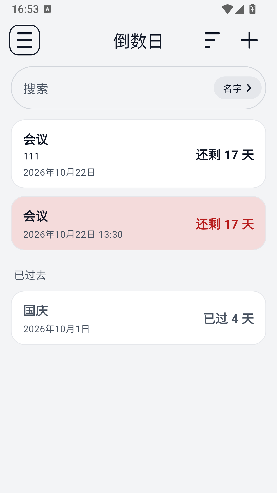
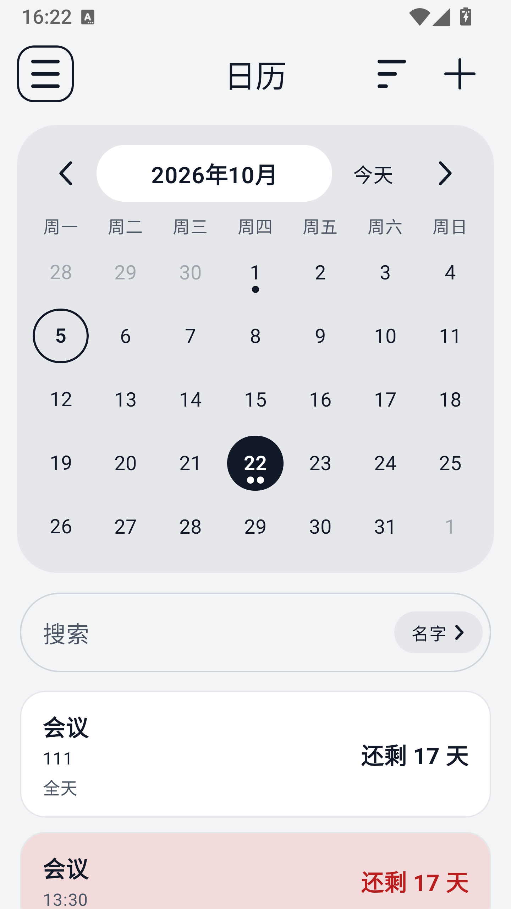
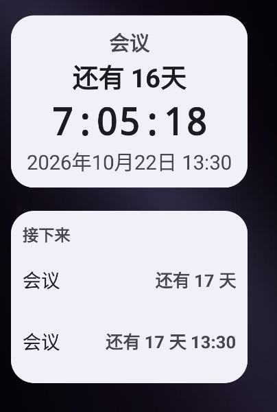

# TickCount

[](https://github.com/ZZPBY/tickcount/actions/workflows/android.yml)
[](LICENSE)

A minimal, fully offline countdown calendar for Android. Tap a day, give it a name, and
see how long is left — or how long it has been.

[中文说明](README.md)

**Under 2 MB · No permissions · Fully offline · No ads · No account · Open source**

<p align="center">
  
  
  
</p>

## Features

- **Drawer navigation** — the menu button at the top left opens a half-screen drawer whose
  entries come in three groups: Home and Calendar to browse, then Appearance and Backup &
  data to set things up, and finally Changelog and About this project to read. Language sits
  on its own at the foot of the drawer.
- **Countdown list** — one rounded card per countdown on the home screen: name, tags and
  date on the left — with the time after the date when the countdown names one — days
  remaining on the right. What has already gone by sits at the foot of the list, under a
  heading of its own.
- **Pin to the top** — switch it on in a countdown's own screen and it leads the list
  however the list is sorted.
- **Sorting** — the button at the top right of a list orders it by **date, nearest first**,
  **date, furthest first**, or **date added, newest first**. The choice is remembered. It
  governs the part still ahead; the past section always runs most recent first.
- **Search** — a box above the list, with a control on the right inside it that switches
  between **name** (which includes tags), **date** and **time**.
- **To the minute** — a countdown can cover a whole day, or be set to an exact hour and
  minute.
- **Multiple tags** — as many per countdown as you like.
- **Your own colour** — each countdown can have one, mixed on a hue strip in the editor.
  Leave it unset and it takes the theme's colour.
- **Countdown screen** — tap a card to open it: the full years, months, days, hours,
  minutes and seconds breakdown, plus the date, the time and the tags.
- **Calendar** — a hand-drawn month grid, with up to three dots on a day that holds
  several countdowns. Tap a day and its countdowns are listed underneath, with the same
  search and sort; the + at the top right adds one on that day, and Today beside the month
  title jumps back to the current month.
- **Fast month switching** — tap the month title for a year-and-month picker with This
  month, ±1 year and ±10 year buttons.
- **Delete asks first** — pressing Delete does not take effect until you confirm.
- **Long press a card** — pin it, change it or delete it without opening it first.
- **Home-screen widgets** — two of them. **Single countdown** puts one countdown on the home
  screen, ticking to the second. **Countdown list** shows what is coming next, one to a row.
  Both adapt to their size, and neither asks for a permission.
- **Themes** — white, black, blue and green, or mix your own on a hue strip. The app does
  not follow the system dark setting and does not take colours from the wallpaper; a choice
  stays put. The colours come from Tailwind CSS.
- **Bilingual** — follows the system language, or you can pick Chinese or English in the
  drawer. Date formats are localised too.
- **Backup and restore** — in Backup & data, every countdown, and the appearance, sorting
  and language settings, can be written to a file and read back; an import either overwrites
  everything or merges into what is here, and says how many it would add or overwrite before
  you choose. An export can be encrypted with a password — asked for twice, with an eye
  beside each field to check it — using AES-256-GCM.
- **Changelog** — every release is listed in the drawer, with the installed one marked.
- **About this project** — read the project's own introduction without leaving the app: its
  features, how the countdown reads and the widget, plus the repository address, ready to
  copy or to open.
- **No permissions, no network, no analytics.**
- One module, no third-party runtime libraries, `minSdk` 27 (Android 8.1).

## How the countdown reads

The target is **00:00 local time on the chosen date**, or the countdown's own time when it
names one. Once that moment has passed, the same arithmetic runs backwards, and the label
changes from “Time left” to “Time since”; on the target day itself it reads “Elapsed today”.

Leading fields that have not started counting yet are filled with dashes, so how far off a
date is can be read at a glance:

| Time left | Shown as |
|---|---|
| 4 months, 11 days, 6 hours, 30 minutes and 15 seconds | `----y 04mo 11d 06h 30m 15s` |
| 2 days and 30 seconds | `----y --mo 02d 00h 00m 30s` |
| 3 years, 4 months, 11 days, 6 hours, 30 minutes and 15 seconds | `0003y 04mo 11d 06h 30m 15s` |

Years, months and days are counted on the calendar, while hours, minutes and seconds are
counted as elapsed time, so the day the clocks change for daylight saving still counts as a
whole day even if it is actually 23 or 25 hours long.

## Home-screen widget

Long-press an empty spot on the home screen → Widgets, and there are two to choose from.

**TickCount · Single countdown** — pick a countdown as well; the list shows each one's time,
so two countdowns on the same day can be told apart before the widget is placed. It starts at
4×2 and rearranges itself as you drag: made short and wide, it becomes one row of name, days
and clock; made larger, it adds the target date and splits the days into “1 year 1 month 4
days”. Tapping it opens that countdown. A countdown that names a time is counted to that
time here too, and says so — on the date line, or after the days in the shapes that have no
date line — so the widget and the countdown screen agree. The seconds are driven by the
system itself, without waking the app.

**TickCount · Countdown list** — nothing to pick: it lists what is coming next on its own,
one to a row, nearest first, and tapping a row opens that countdown. A countdown that names
a time says so after the days — “Today 09:30”. The default 4×2 holds three rows and a taller
widget holds four, and the rows share the height between them; with nothing coming up it says
so.

Neither asks for a permission.

## Download

APKs are published in [Releases](../../releases/latest), and any successful build can
also be downloaded from the **Actions** tab. What changed in each version is in
[`更新日志.txt`](更新日志.txt).

## Building

You need:

- JDK 17
- Android SDK Platform 37 and Build Tools 36.0.0
- the SDK path in `local.properties`, or `ANDROID_HOME` exported

```bash
./gradlew testDebugUnitTest   # unit tests
./gradlew assembleRelease     # APK -> app/build/outputs/apk/release/
```

On Windows, use `gradlew.bat`.

## Built with

| | |
|---|---|
| Language | Kotlin 2.4.20 |
| UI | Jetpack Compose + Material 3 (Compose BOM 2026.09.00) |
| Build | AGP 9.4.1, Gradle 9.6.0, with all versions in `gradle/libs.versions.toml` |
| SDK | compileSdk 37, targetSdk 36, minSdk 27 |
| Storage | a small JSON document in `SharedPreferences` |
| Dependencies | at runtime, AndroidX and Compose only |

`minSdk` is 27. `java.time` arrived in API 26 and the theme's `windowLightNavigationBar`
in 27, so the project needs neither `coreLibraryDesugaring` nor any compatibility shim,
and the theme does not have to be split in two by version.

## Project layout

```
app/src/main/java/io/github/zzpby/tickcount/
├── MainActivity.kt              edge-to-edge host + the app theme, system-bar icon colours included
├── data/                        the model and how it is stored
│   ├── CountdownEvent.kt        the model: id / date / time / tags / colour / pinned
│   ├── EventCodec.kt            reading and writing the records as JSON, migrations included
│   ├── EventStore.kt            keeping that document in SharedPreferences
│   ├── SettingsStore.kt         the stored theme, sort order and language
│   ├── Backup.kt                the backup file's shape, and the outcome of an import
│   └── BackupCrypto.kt          password encryption for a backup (PBKDF2 + AES-GCM)
├── domain/                      pure logic, covered by unit tests
│   ├── Countdown.kt             the y/mo/d/h/m/s split and the dash placeholder
│   ├── CalendarMath.kt          building the month grid
│   ├── CountdownList.kt         ordering, sections and day distance
│   ├── Search.kt                what the search box looks at, and what counts as a match
│   ├── Changelog.kt             splitting the changelog into versions
│   ├── Readme.kt                pulling the introduction's sections out of the README
│   └── WidgetCountdown.kt       the widget's day split, shape rules and list picking
└── ui/
    ├── MainViewModel.kt         the state, and the process's only clock
    ├── TickCountApp.kt          the root: drawer, screen switching, back, dialogs
    ├── AppDrawer.kt             the side drawer
    ├── AppTitleBar.kt           the title bar: menu or back, name, action slot
    ├── HomeScreen.kt            the countdown list
    ├── CalendarScreen.kt        the month grid, and the chosen day's countdowns
    ├── EventCard.kt             the countdown card, shared by both lists
    ├── SearchField.kt           the search box and its scope control
    ├── EventDetailScreen.kt     one countdown's own screen
    ├── EventEditorDialog.kt     new or edit: name, tags, date, time, colour
    ├── DeleteConfirmDialog.kt   the confirmation before a delete
    ├── AppearanceScreen.kt      appearance: four theme presets and a custom hue
    ├── DataScreen.kt            data management: export, import, and the optional encryption
    ├── ChangelogScreen.kt       the changelog, taken from `更新日志.txt` in the repository
    ├── ProjectIntroScreen.kt    the introduction, taken from this file
    ├── calendar/                the hand-drawn month grid and the month picker
    ├── components/              Canvas icons, the hue strip, the Markdown renderer, localised formats
    ├── widget/                  the two home-screen widgets: drawing, receivers, config screen
    └── theme/                   the Material 3 palettes (Tailwind colour values) and the typography
```

The countdown arithmetic, list ordering, search matching, the widget's day split and what
its list picks, changelog parsing, backup encoding and encryption, README section extraction
and the Markdown parser are all covered by the unit tests in `app/src/test/`, along with
month lengths, leap days, year boundaries, both daylight-saving changes, and the “today is
not past” boundary that is so easy to get wrong by a day.

## App icon


Vector XML cannot draw Chinese characters, so the launcher's lettering is rasterised by
[`.tools/图标生成/IconGen.java`](.tools/图标生成/IconGen.java): it loads Microsoft YaHei,
scales the characters to land exactly inside the 66dp safe circle of an Android adaptive
icon, and writes a PNG into `res/drawable-xxxhdpi/`.

```bash
java .tools/图标生成/IconGen.java app/src/main/res/drawable-xxxhdpi/ic_launcher_foreground.png
```

## Privacy

TickCount stores one list of countdowns — date, name, time, tags, colour, pin and when it
was added — in its own private `SharedPreferences` file, with nothing else in it. The
colour belongs to each countdown and is used to tell them apart in the calendar and the
list. The home-screen widget keeps a second file, `tickcount_widgets`, recording only which
widget shows which countdown; the theme, sort order and language live in
`tickcount_settings`. All three sit in the app's private directory, and none of them leaves
the device on its own.

A backup exported from Backup & data goes wherever you choose to put it, encrypted or not,
as you decide; the app has no way to send it anywhere.
The app declares no permissions, makes no network requests, and contains no analytics or
advertising. There is a link to this repository in the introduction; tapping it opens the
address in the browser, because TickCount has no network ability of its own and no
`INTERNET` permission. That data leaves the device only if Android's own cloud backup is on,
which is what `res/xml/backup_rules.xml` decides.

## Licence

[MIT](LICENSE).
