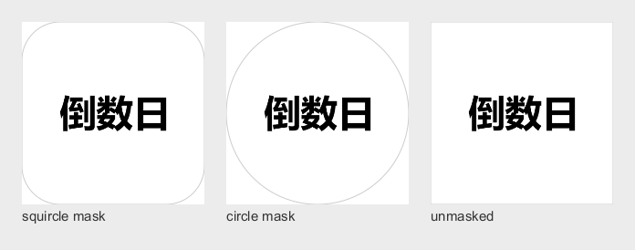

# TickCount

A tiny, offline Android app that answers one question: **how long until — or since — a date?**

Pick any day on the calendar, give it a name, and the top of the screen breaks the
distance down into **years, months, days, hours, minutes and seconds**, ticking live.
It counts *up* for dates that have already passed, so it works for anniversaries and
"days since" just as well as for countdowns.

*Read this in [中文](README.zh-CN.md).*

---

## Features

- **Countdown to any date** — tap a day, name it, done.
- **One fixed-width line** — `yyyy年MM月dd日 HH时mm分ss秒`, ticking live. Only the
  *leading* units are blanked, with dashes the width of their pattern letter, so a
  countdown under a year reads `----年04月11日 06时30分15秒`, while a zero that sits
  between counting units stays a real number: `----年--月02日 00时00分30秒`. Nothing
  flickers to dashes mid-count. Monospace keeps every slot the same width, so the
  line never shifts or reflows as the seconds tick.
- **Counts up for the past** — the same line, labelled "Time since".
- **As many countdowns as you like** — every named day gets a coloured dot on the
  calendar, so a month at a glance shows what is coming.
- **Jump anywhere quickly** — tap the month title to open a year/month picker with
  one-year and ten-year steps, instead of tapping "next month" thirty times.
- **Days without a countdown show the blanked line** —
  `----年--月--日 --时--分--秒`. A countdown is something you create; the app does
  not invent one for every day you browse past.
- **Material 3**, light and dark, with wallpaper-based dynamic colour on Android 12+.
- **Chinese and English**, following the system language. Dates are formatted with
  locale-aware patterns (`2027年2月6日 星期六` / `Saturday, February 6, 2027`).
- **No permissions, no network, no analytics.** The app cannot phone home because
  it never asks for the ability to.
- Small: a single module, no third-party UI or calendar libraries, minSdk 29.

## What exactly is being counted

The countdown targets **00:00 local time on the chosen date** — the only definition
under which "how long until the 6th" is unambiguous. Once that midnight has passed,
the same arithmetic runs backwards and the label switches from "Time left" to
"Time since", so a countdown becomes an anniversary without any special casing.

Years, months and days are **calendar** arithmetic — a month is a month however long
it is — while hours, minutes and seconds are elapsed time. That is the only way
"1 year 2 months 5 days" can mean anything, and it is why the split is computed with
`ChronoUnit` rather than by dividing a millisecond total. A daylight-saving day is
still reported as one day, even though it is 23 or 25 hours long.

See [`Countdown.kt`](app/src/main/java/io/github/zzpby/tickcount/domain/Countdown.kt).

## Download

Grab the APK from the [latest release](../../releases/latest), or from the
artifacts of any green CI run under **Actions**.

Install it by opening the file on your phone (you will need to allow installing
from unknown sources for your browser or file manager).

> **Signing note.** Releases published by CI are signed with the standard Android
> *debug* key, because the repository has no private signing key. The APK is
> minified and not debuggable, and installs fine, but it is not suitable for
> publishing to Google Play. If you fork this and want real releases, create a
> `keystore.properties` in the project root (it is `.gitignore`d):
>
> ```properties
> storeFile=release.jks
> storePassword=…
> keyAlias=…
> keyPassword=…
> ```
>
> `assembleRelease` will then use your key automatically. Note that switching keys
> means users must uninstall the debug-signed build first.

## Building

Requirements:

- JDK 17
- Android SDK Platform 37 (`android-37`) and Build Tools 36.0.0
- The Android SDK location in `local.properties`, or `ANDROID_HOME` exported

```bash
# unit tests
./gradlew testDebugUnitTest

# installable APK -> app/build/outputs/apk/release/
./gradlew assembleRelease
```

On Windows use `gradlew.bat` instead of `./gradlew`.

## Tech stack

| | |
|---|---|
| Language | Kotlin 2.4.20 |
| UI | Jetpack Compose, Material 3 (Compose BOM 2026.09.00) |
| Build | AGP 9.4.1, Gradle 9.6.0, version catalog in `gradle/libs.versions.toml` |
| SDK | compileSdk 37, targetSdk 36, minSdk 29 |
| Storage | `SharedPreferences` holding one small JSON document |
| Dependencies | AndroidX + Compose only — no third-party libraries at all |

Because `minSdk` is 29, `java.time` is available from the platform: no
`coreLibraryDesugaring`, no compatibility shims.

### Project layout

```
app/src/main/java/io/github/zzpby/tickcount/
├── MainActivity.kt              edge-to-edge host
├── data/                        CountdownEvent model + JSON persistence
├── domain/                      pure, unit-tested logic
│   ├── Countdown.kt             the year/month/day/h/m/s breakdown
│   └── CalendarMath.kt          month grid construction
└── ui/
    ├── MainViewModel.kt         state + the one clock in the process
    ├── TickCountScreen.kt       the single screen
    ├── calendar/                hand-rolled month grid + year/month picker
    ├── countdown/               the header
    └── theme/                   Material 3 colour and type
```

### App icon

The launcher icon is black 倒数日 on white:



Vector XML cannot draw CJK glyphs, so the label is rasterised by
[`tools/IconGen.java`](tools/IconGen.java) — a small JDK program that loads
Microsoft YaHei, sizes the text to fit Android's 66 dp adaptive-icon safe circle,
and writes the PNG that ships in `res/drawable-xxxhdpi/`. Re-run it if you want to
change the label:

```bash
java tools/IconGen.java app/src/main/res/drawable-xxxhdpi/ic_launcher_foreground.png
```

## Privacy

TickCount stores a list of `(date, name)` pairs in its own private
`SharedPreferences`, and nothing else. It declares **no permissions**. It makes no
network requests, contains no analytics and no ads. The only thing that leaves the
device is the list itself, if you have Android's own cloud backup enabled — and
`res/xml/backup_rules.xml` decides that.

## License

[MIT](LICENSE). Do whatever you like with it.
