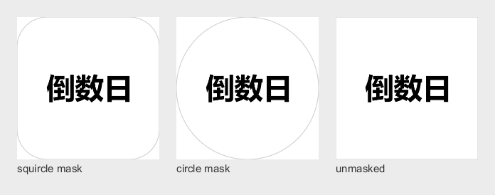

# TickCount

[](https://github.com/ZZPBY/tickcount/actions/workflows/android.yml)
[](LICENSE)

一个极简、纯离线的安卓倒数日日历。在日历上点一天、起个名字，就能看到距离（或已经过去）
那一天还有多久。

## 功能

- **倒数到任意一天** —— 点日历上的一天，起个名字。
- **单行定宽显示** —— `yyyy年MM月dd日 HH时mm分ss秒`，每秒跳动。
- **过去的日子往上数** —— 同一行，标签换成「已过去」。
- **支持多个倒数日** —— 每个命名的日子在日历上有一个彩色小圆点，一眼看清这个月有什么。
- **一栏看全部** —— 点顶部的圆角矩形，浮层列出所有倒数日的名字和日期，点一条直接跳过去。
- **快速翻月** —— 点月份标题会弹出年月选择窗，带「±1 年」和「±10 年」按钮。
- **删除前会确认** —— 点「删除」不会立刻生效，先问一次。
- **关于** —— 右上角的入口，说明这个应用是什么、什么版本、源码在哪。
- **更新日志** —— 左上角的入口，应用内直接看历次改动，内容取自仓库根目录的同名文件。
- **桌面小组件** —— 把某一天放到桌面上，时分秒实时跳动，随尺寸自动换排版，依然是零权限。
- **Material 3** —— 亮色 / 暗色，Android 12+ 支持跟随壁纸取色。
- **中英双语** —— 跟随系统语言，日期格式也本地化。
- **不要任何权限、不联网、无统计。**
- 单模块，不含任何第三方库，`minSdk` 27（Android 8.1）。

## 倒计时的读法

目标是**所选日期当地时间的 00:00**。这个时刻过去之后，同一套算法反向运行，
标签从「还有」变成「已过去」。

仍然处于**高位**（自身为 0，且所有更高位也为 0）的字段，会用与格式字母等宽的短横线占位；
而夹在计数单位中间的 0 保留为真实的数字，因此正常倒数时不会闪出短横线：

| 剩余时间 | 显示 |
|---|---|
| 4 个月 11 天 6 时 30 分 15 秒 | `----年04月11日 06时30分15秒` |
| 2 天 30 秒 | `----年--月02日 00时00分30秒` |
| 3 年 4 个月 11 天 6 时 30 分 15 秒 | `0003年04月11日 06时30分15秒` |
| 未设置倒数日 | `----年--月--日 --时--分--秒`（上方状态行显示「待定」） |

整行使用等宽字体，数字与短横线宽度完全一致，因此秒数跳动时不会左右抖动。
字号在运行时实测并缩放至可用宽度，保证在任何机型和字体缩放下都保持单行。

年、月、天使用日历运算，小时、分、秒使用流逝时间。因此夏令时切换的那一天
仍然算作一天，哪怕它实际只有 23 或 25 小时。实现见
[`Countdown.kt`](app/src/main/java/io/github/zzpby/tickcount/domain/Countdown.kt)。

## 桌面小组件

长按桌面空白处 → 添加小组件 → 选「TickCount」，再挑一个倒数日。默认 4×2，拖动之后
自动换排版：拖扁了是「名字 + 天数 + 时钟」一行，拖大了再加上目标日期，并把天数拆成
「1年1个月4天」。每一行按权重瓜分整个组件，文字在各自分到的空间里自动放大，所以不会
缩在中间、四周留一圈空白。

秒针由一个 `Chronometer` 驱动，由系统自己走，不需要唤醒应用。每 30 分钟一次的系统更新
只用来重算天数和在午夜重新对齐时钟。午夜那次用的是 `setAndAllowWhileIdle`，非精确闹钟，
因此**仍然不需要任何权限**。

组件在所有尺寸下只用一份布局，靠显示 / 隐藏切换形态。换布局资源会让部分第三方桌面
把后续更新全部丢掉：它们自己重写的 `AppWidgetHost` 在 layout id 变化时不重新 inflate，
于是每一次操作都打在不存在的控件上，被静默忽略，画面从此卡死。

⚠️ **vivo / iQOO 已知问题**：vivo 的后台管理会在一段时间后限制 TickCount 在后台运行，
此后系统不再把尺寸变化通知给应用，画面会停在拖动前的那一种排版，不会自己恢复。
把 TickCount 加入「自启动」白名单，并在「设置 → 电池 → 后台高耗电」里允许它后台运行，
可以从根本上避免；万一已经卡住，打开一次 TickCount 再退出即可恢复，不必删掉组件重加。
其它桌面（如 Nova）不受影响。

## 下载

APK 发布在 [Releases](../../releases/latest)，也可以从 **Actions** 标签页里
任意一次成功的构建中下载产物。每个版本改了什么见 [`更新日志.txt`](更新日志.txt)。


## 编译

需要：

- JDK 17
- Android SDK Platform 37 和 Build Tools 36.0.0
- 在 `local.properties` 里写好 SDK 路径，或导出 `ANDROID_HOME`

```bash
./gradlew testDebugUnitTest   # 单元测试
./gradlew assembleRelease     # APK -> app/build/outputs/apk/release/
```

Windows 下使用 `gradlew.bat`。

## 技术栈

| | |
|---|---|
| 语言 | Kotlin 2.4.20 |
| UI | Jetpack Compose + Material 3（Compose BOM 2026.09.00） |
| 构建 | AGP 9.4.1、Gradle 9.6.0，版本集中在 `gradle/libs.versions.toml` |
| SDK | compileSdk 37、targetSdk 36、minSdk 27 |
| 存储 | `SharedPreferences` 里存一个小 JSON 文档 |
| 依赖 | 仅 AndroidX 与 Compose |

`minSdk` 为 27。`java.time` 在 API 26 就有了，主题里的 `windowLightNavigationBar`
在 27 也有了，所以既不需要 `coreLibraryDesugaring`，也不需要任何兼容垫片，
更不必把主题按版本拆成两份。

## 目录结构

```
app/src/main/java/io/github/zzpby/tickcount/
├── MainActivity.kt              边到边（edge-to-edge）宿主
├── data/                        CountdownEvent 模型 + JSON 持久化
├── domain/                      纯逻辑，有单元测试
│   ├── Countdown.kt             年/月/天/时/分/秒 的拆解与占位格式化
│   ├── CalendarMath.kt          月历网格构造
│   ├── CountdownList.kt         列表排序与「已过去」判定
│   └── WidgetCountdown.kt       小组件的天数拆分与形态判定
└── ui/
    ├── MainViewModel.kt         状态 + 全进程唯一的那个时钟
    ├── TickCountScreen.kt       唯一的界面
    ├── AppTitleBar.kt           顶部标题栏（名字 + 关于入口）
    ├── AboutDialog.kt           关于弹窗
    ├── EventEditorDialog.kt     给某一天命名 / 改名的弹窗
    ├── DeleteConfirmDialog.kt   删除前的确认弹窗
    ├── calendar/                手写月历 + 年月选择窗
    ├── components/              Canvas 箭头图标 + 本地化日期格式
    ├── countdown/               顶部倒计时 + 可展开的倒数日列表
    ├── widget/                  桌面小组件：渲染、接收器、配置界面
    └── theme/                   Material 3 配色与字体
```

倒计时算法和列表排序由 `app/src/test/` 下的单元测试覆盖，包括月长、闰日、跨年、
两种夏令时切换，以及「今天不算已过去」这个容易差一天的边界。

## 应用图标



矢量 XML 无法绘制汉字，因此启动器文字由
[`.tools/图标生成/IconGen.java`](.tools/图标生成/IconGen.java) 栅格化：
它加载微软雅黑，把文字缩放到正好落在 Android 自适应图标的 66dp 安全圆内，
再输出 `res/drawable-xxxhdpi/` 中的 PNG。

```bash
java .tools/图标生成/IconGen.java app/src/main/res/drawable-xxxhdpi/ic_launcher_foreground.png
```

## 隐私

TickCount 只在自己私有的 `SharedPreferences` 中保存一份 `(日期, 名称, 颜色)` 列表，
别无其他。颜色是每个倒数日自己的圆点色，用来在日历和列表里区分它们。桌面小组件另有一份
`tickcount_widgets`，只记录「哪个小组件显示哪一天」，同样存在应用私有目录里。
它不声明任何权限，不发起网络请求，不含统计与广告。关于框里有一个指向本仓库的链接，
点击时交给浏览器打开——TickCount 自己没有联网能力，也没有 `INTERNET` 权限。
该列表仅在 Android 自身的云备份开启时才会离开设备，而这由 `res/xml/backup_rules.xml` 决定。

## 许可

[MIT](LICENSE)。
